# Ransomware Investigation: SOC145 - Ransomware Detected  
## LETSDEFEND.IO SIEM

This document details the investigation of an alert triggered on the **LETSDEFEND platform SIEM**. The event relates to ransomware detection and provides step-by-step insights into identifying, analyzing, and confirming malicious activity.

---

## **Overview**  
On **May 23, 2021**, at **07:32 PM**, an alert was triggered for **Event ID: 92**, titled **SOC145 - Ransomware Detected**. The alert indicated a suspicious file, `ab.exe`, was allowed to execute on the endpoint `MarkPRD`.  

Further investigation revealed that the file exhibited ransomware behavior. This document explains how the analysis was conducted, using logs, endpoint data, and advanced malware analysis tools to confirm the nature of the alert.

---

## **Incident Details**  

### Alert Metadata  
- **Event ID:** 92  
- **Event Time:** May 23, 2021, 07:32 PM  
- **Source Hostname:** MarkPRD  
- **Source Address:** 172.16.17.88  
- **File Name:** `ab.exe` (originally `ab.bin`)  
- **File Hash (MD5):** `0b486fe0503524cfe4726a4022fa6a68`  
- **File Size:** 775.50 KB  
- **Device Action:** Allowed  

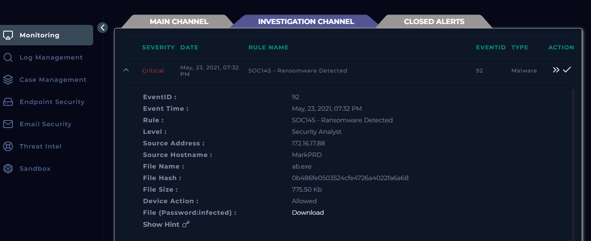  
*Screenshot of the Event Alert from LETSDEFEND SIEM.*

---

## **Investigation Process**  

### **1. Initial Alert and File Source**  
The file `ab.exe` was identified as the suspicious object. Upon investigation:  
- The file was downloaded from a ZIP archive.  
- It was originally named `ab.bin`.  
- After extracting the ZIP file, renaming `ab.bin` to `ab.exe` allowed the executable to run, triggering malicious activity.  

---

### **2. Log Management Analysis**  
We searched for network logs around the time of the alert to check for any external communication, such as Command-and-Control (C2) activity.  
- **Observation:** No suspicious network activity or logs correlated with the file's execution were found.  

This suggests that while the ransomware executed locally, it may not have attempted to contact a remote server.  

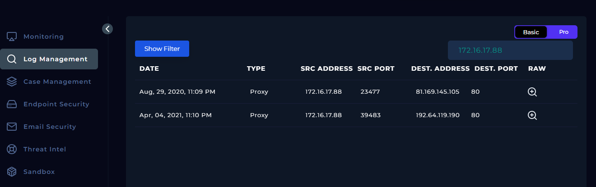  
*Screenshot showing the log management investigation.*

---

### **3. Endpoint Analysis**  

#### **Endpoint Information**  
Details of the infected endpoint:  
- **Hostname:** MarkPRD  
- **Domain:** LetsDefend  
- **Primary User:** MarkGuna  
- **OS:** Windows 10 (64-bit)  
- **Last Login:** Aug 29, 2020, 08:12 PM  

The endpoint was analyzed for any changes or suspicious behavior.  

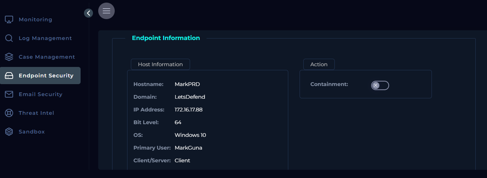  
*Screenshot of the endpoint information.*  

---

#### **Process History**  
The endpoint’s process history revealed:  
- Execution of `ab.exe`, leading to the spawning of several processes like `rundll32.exe` and `ShadowCopy.exe`.  
- Disabling of **shadow copy** and recovery settings (a common tactic used by ransomware to prevent file recovery).  

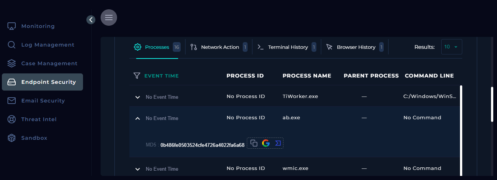  
*Screenshot of the process history showing the execution of `ab.exe`.*  

Additionally, several other suspicious processes were observed after the malicious file executed.  

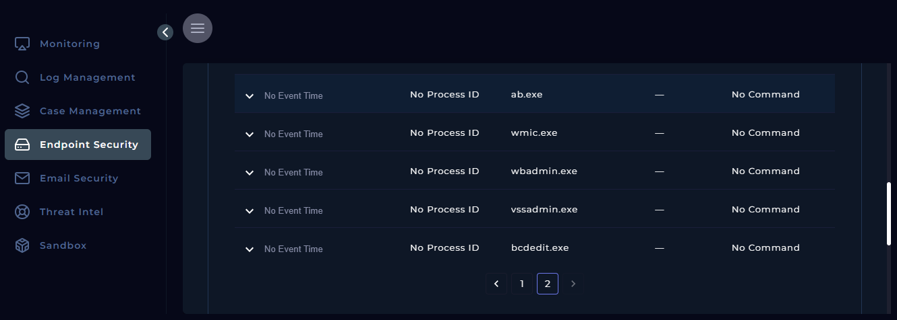  
*Screenshot of suspicious processes post-execution.*

---

### **4. File Analysis**  

#### **a. VirusTotal**  
The file hash (`0b486fe0503524cfe4726a4022fa6a68`) was analyzed on **VirusTotal**.  
- Most security vendors flagged it as ransomware.  

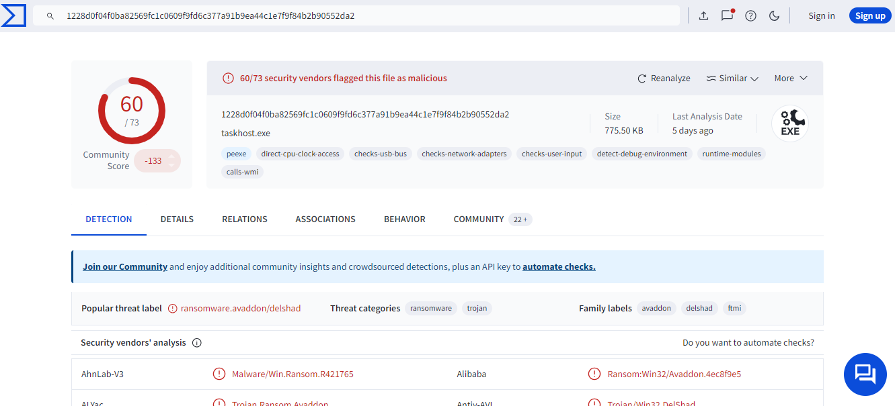  
*Screenshot of VirusTotal analysis showing ransomware classification.*  

#### **b. Hybrid Analysis**  
Analysis on **Hybrid Analysis** revealed the following behaviors:  
- Deletion of volume snapshots (often used by ransomware).  
- Spawning multiple processes to maintain persistence.  
- Modifying files, including ransom notes.  

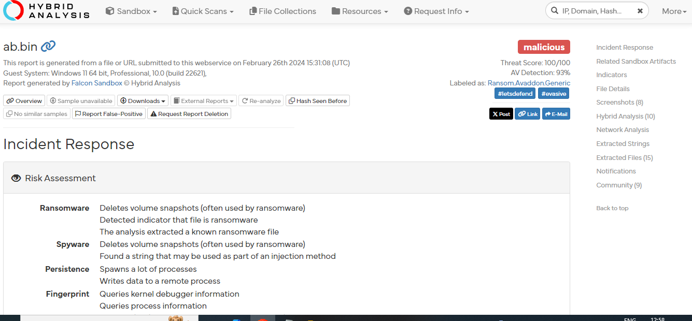  
*Screenshot of Hybrid Analysis report.*  

#### **c. Any.Run Sandbox Analysis**  
The file was executed in the **Any.Run** sandbox, where detailed behaviors were observed:  
- `ab.exe` initiated processes such as `rundll32.exe` and `ShadowCopy.exe`.  
- Brief instances of PowerShell execution were noted.  
- A ransom note file (`UZIZ8_readme_text`) was created, warning that files were encrypted.  

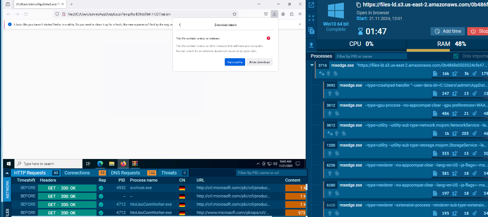  
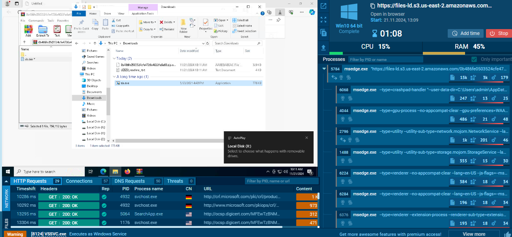  
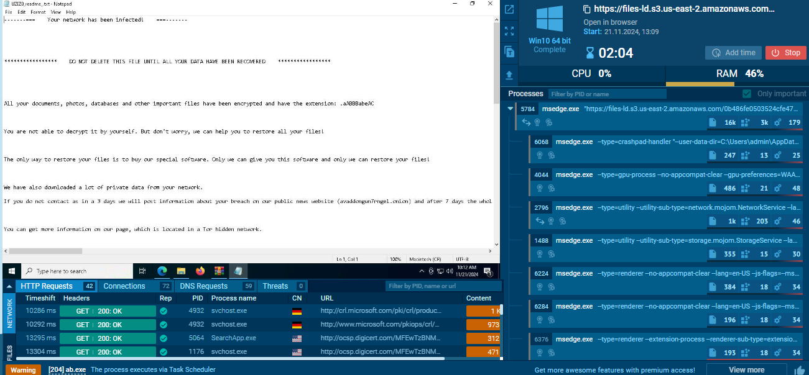  
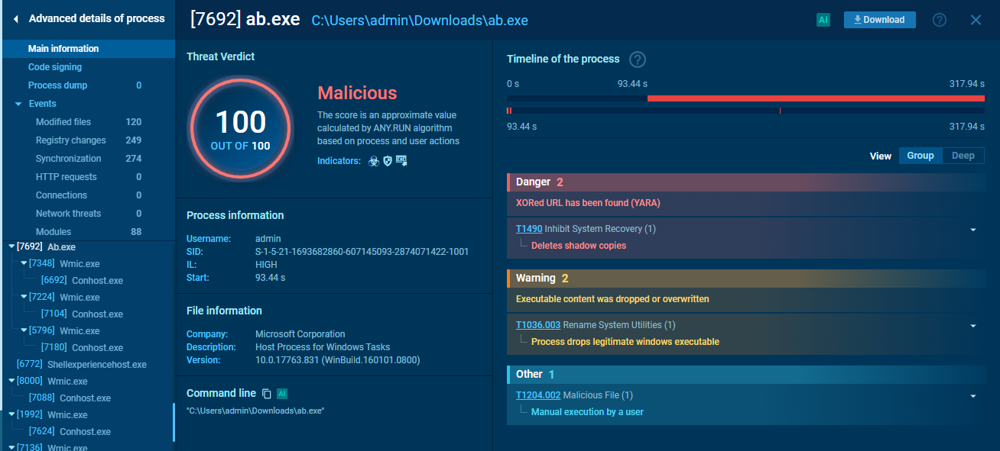  
*Screenshots of Any.Run sandbox analysis results.*

---

## **Conclusion**  
This investigation confirms the alert as a **true positive** for ransomware activity.  
- The malicious file `ab.exe` successfully executed, disabled recovery features, and encrypted files.  
- Ransomware behaviors were corroborated by sandbox and antivirus tools.  

No network communication was observed in logs, suggesting that the ransomware was primarily focused on local damage.  

---

## **Artifacts and Observations**  

| **Artifact**                     | **Type**       | **Description**                                |
|----------------------------------|----------------|-----------------------------------------------|
| `0b486fe0503524cfe4726a4022fa6a68` | File Hash      | Flagged by multiple antivirus tools.           |
| `UZIZ8_readme_text`              | Ransom Note    | File created by the ransomware post-execution. |
| `ShadowCopy.exe`                 | Process        | Abused to disable recovery settings.           |
| `ab.bin`                         | Original File  | Renamed to `ab.exe` to trigger execution.      |

---

## **Next Steps**  
### Recommendations:  
1. **Containment:** Isolate the affected machine (`MarkPRD`) from the network to prevent potential spread.  
2. **Eradication:** Remove the ransomware and inspect other devices for signs of compromise.  
3. **Recovery:** Restore files from a secure backup.  
4. **Prevention:**  
   - Educate users on avoiding suspicious files.  
   - Implement stricter email and file download policies.  

---

## **Screenshots**  
All screenshots used in this investigation are stored in the `./screenshots/` directory:  
- Event Alert  
- Log Management Findings  
- Endpoint Information and Process History  
- Sandbox Results (Any.Run, VirusTotal, Hybrid Analysis)

**Acknowledgment:**

This investigation was conducted using the LETSDEFEND platform, leveraging SIEM log analysis and sandbox malware investigation tools.

